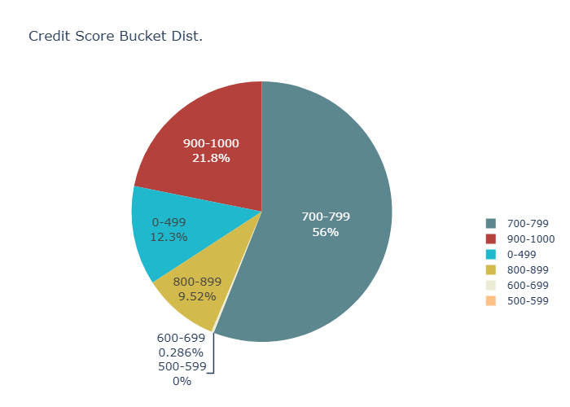

# 📊 Analysis: Wallet Credit Scores & Behavior

## 📈 Score Distribution

Below is a **pie chart** showing the distribution of wallets across credit score buckets:

---

## 🧠 Behavior of Wallets by Score Range

### 🔹 High Score Range (700+)
- High repay ratio (typically ≥ 0.95)
- Short repay delays (within days to a month)
- Multiple protocol actions (borrow, repay, redeem, etc.)
- Long activity spans and multiple tokens used
- No asset mismatch between borrowed and repaid tokens

### 🔸 Middle to Low Score Range (0–700)
- Few or no repayments (low repay ratio)
- Long or infinite delays before first repayment
- Single-action users (e.g., only deposit or only borrow)
- High transaction count but low diversity (bot-like behavior)
- Asset mismatch flagged
- Short protocol activity window

---

## 💡 Insights

- Most wallets fall in the **Moderate** or **Strong** categories.
- Trustworthy users repay in full and promptly, engage with the protocol regularly, and use multiple features.
- Rule-based scoring leads to **clustered scores**—few “average” score cases without more granular logic.
- **Key feature**: `repay_ratio` — fast, full repayment and diverse engagement heavily influence scores.
- For smoother score transitions, consider using **machine learning** or refining scoring thresholds.

---

## 🔄 Next Steps

- Introduce smaller penalties/bonuses for more gradual score differences
- Integrate ML-based scoring, anomaly detection, or graph analysis when labeled data becomes available

